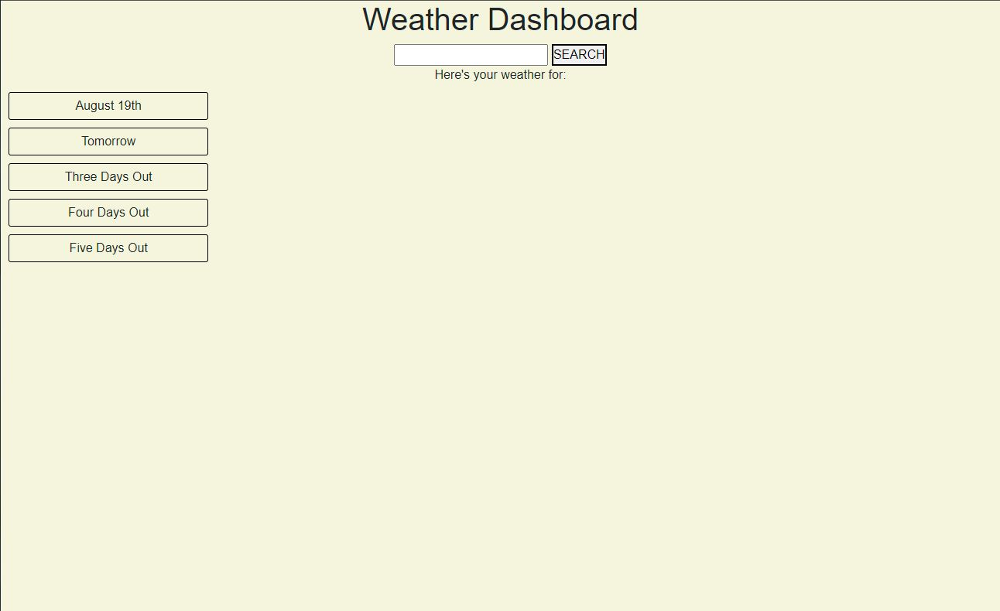

# weather-dashboard

## User Story

As a user I want to be able to look up weather for multiple cities over 5 days to better plan a trip.

## Acceptance Criteria

```
GIVEN a weather dashboard with form inputs
WHEN I search for a city
THEN I am presented with current and future conditions for that city and that city is added to the search history
WHEN I view current weather conditions for that city
THEN I am presented with the city name, the date, an icon representation of weather conditions, the temperature, the humidity, the wind speed, and the UV index
WHEN I view the UV index
THEN I am presented with a color that indicates whether the conditions are favorable, moderate, or severe
WHEN I view future weather conditions for that city
THEN I am presented with a 5-day forecast that displays the date, an icon representation of weather conditions, the temperature, the wind speed, and the humidity
WHEN I click on a city in the search history
THEN I am again presented with current and future conditions for that city
```

## Links to the project

**[Github Link](https://github.com/SFSullivan/weather-dashboard)**

**[Deployed App](https://sfsullivan.github.io/weather-dashboard/)**

## Screenshot of the project


